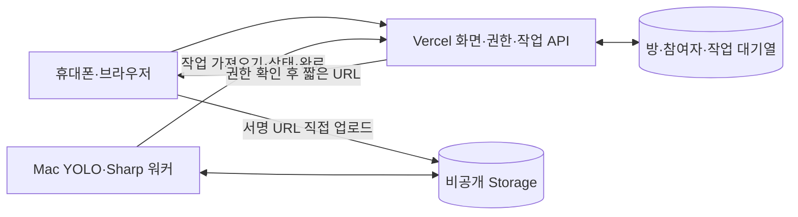

# 사진 병합 서비스 요구사항

## 목적

여러 사람이 같은 원본 사진을 각자 보정한 뒤, 마음에 드는 부분을 모아 한 장으로 합치는 서비스입니다. 원본 위에 선택한 부분을 색종이처럼 붙이며, 사진 전체를 다시 생성하지 않습니다.

CrowdSift와 분리된 사진 병합 전용 프로젝트입니다. 외부 앱에서 만든 보정본을 사용하며, 서비스 안에서 외부 사진 API로 보정을 요청하지 않습니다.

## 사용자 흐름과 화면

PC에서는 중앙 402px, 휴대폰에서는 기기 너비 전체를 사용하는 모바일 웹입니다. Figma의 색상·글꼴·상단 진행 표시·하단 버튼을 따르며 기기의 상태 표시줄과 주소창은 재현하지 않습니다. 별도 앱 설치가 필요하지 않습니다.

1. 대표자가 이름과 원본 JPEG·PNG를 등록하고 공유 링크를 만듭니다.
2. 대표자는 초대 링크 공유 후 원본에서 자신의 ID를 여러 개 선택합니다. 참여자는 초대 수락 후 외부 앱에서 보정한 사진을 먼저 업로드한 다음 자신의 ID를 선택합니다. 화면의 원본 다운로드 버튼은 제공하지 않습니다. 원본 YOLO 결과를 방에 한 번 저장해 같은 ID를 공유합니다. ID는 사진 속 검출 영역의 번호이며 신원 인식이 아닙니다.
3. 필요하면 확대 화면에서 윤곽선 점을 드래그하거나 브러시·지우기로 수정합니다. 드래그는 브라우저에서 처리하고 상세 화면의 ‘완료’는 변경을 화면 초안에 확정합니다. 미완료 상태에서 상세 화면을 나가면 안내 후 상세 편집 전 초안으로 되돌립니다. ‘다음’ 또는 ‘제출’에서 원본 크기 흑백 마스크와 선택 ID를 서버에 저장합니다.
   - 점을 옮겨도 편집점 개수는 유지하며, 이동한 구간의 기존 경계가 조각으로 남지 않도록 교체합니다.
4. 대표자는 자신이 올렸던 원본을 외부 앱에서 보정하고 같은 크기의 보정본을 업로드합니다. 저장한 원본 영역을 업로드한 보정본에 적용해 자동 제출하며, 저장에 실패한 경우 업로드한 보정본으로 재시도합니다.
5. 참여자는 보정본 업로드 후 같은 좌표의 얼굴 영역을 확인·수정해 제출합니다. 원본 영역과 보정본 선택 저장이 모두 성공해야 제출 완료입니다. 자동 정렬·자동 얼굴 매칭은 하지 않습니다.
6. 비어 있지 않은 영역과 보정본을 제출한 참여자가 한 명 이상이면 대표자만 현재 결과를 병합할 수 있습니다. 미제출자의 과거 선택은 합성에서 제외하고 해당 얼굴은 원본 그대로 유지합니다. 나중에 제출하면 대표자가 최신 버전으로 다시 병합합니다.
7. 겹친 부분은 대표자가 기존 겹침 편집기로 사용할 보정본을 지정하고 다시 합칩니다. 모든 참여자는 결과를 확인하고 원본 크기 PNG를 내려받습니다.

보정본이 여러 장이면 썸네일로 고르고 각 보정본·마스크 쌍을 유지합니다. 제출 완료한 참여자의 저장된 쌍만 합성합니다. 원본 영역 재저장·새 보정본 업로드·빈 마스크 저장은 제출 완료를 해제하며, 다시 영역을 제출해야 합니다. 동일한 검출 ID는 먼저 선택한 참여자만 선택·저장할 수 있습니다. 수동 편집으로 생기는 픽셀 겹침은 기존 합성 흐름에서 확인합니다.

보정본 표시와 참여자 현황은 각 참여자가 처음 보정본을 업로드한 순서로 고정합니다. 같은 사람의 보정본은 그 안에서 업로드 순으로 묶고, 아직 업로드하지 않은 참여자는 뒤에 참여자 ID 순으로 표시합니다. 서버는 파일 저장 후 DB 등록 트랜잭션에서 보정본에만 방 안의 고유 `uploadOrder`를 부여합니다. 마스크 업로드·수정·재제출은 순서를 바꾸지 않습니다. 썸네일과 겹침 수정 목록의 이름은 참여자 ID로 연결한 닉네임을 사용하며, 첫 사진은 `진준영`, 추가 사진은 `진준영 2`처럼 표시합니다. 사진 선택은 파일 ID로 유지하며 주소의 `photo`·`overlapPhoto`로 새로고침 후에도 복원합니다. 복원은 현재 화면에서 접근 가능한 보정본으로 제한하고 공유 초대 링크에는 이 값을 포함하지 않습니다. 이 표시 순서는 합성의 겹침 우선순위와 별개입니다. 기존 보정본의 과거 업로드 순서는 복원할 수 없어, 전환 시 기존 파일 ID 조회 순서로 한 번 초기화합니다.

선택·보정 화면은 현재 참여 별명을 표시합니다. 사진 속 사람을 누르면 영역을 선택하고 다시 누르면 해제하며, 화면에는 ID 번호·선택 ID 목록·ID 버튼·첫 선택 바텀시트를 표시하지 않습니다. 내부 검출 ID와 저장 형식은 유지합니다. ‘영역 직접 다듬기’로 여는 어두운 상세 화면에는 화면 기준 작은 편집점과 간격을 둔 점선 윤곽을 표시하되 실제 마스크·윤곽 좌표는 변경하지 않습니다. 상세 화면을 완료 없이 닫거나 뒤로가면 수정 유실을 확인하고, 이탈 시 열기 전 초안을 복원합니다. 대표자의 원본 선택은 ‘다음’, 참여자의 보정본 선택은 ‘제출’로 저장합니다. 클릭은 서버에 검출 ID 선점을 기록하고 다시 클릭하면 본인의 선점을 해제합니다. 상세 화면의 ‘완료’는 마스크 초안만 확정합니다. 현황·결과 화면의 ‘추가 기능’ 메뉴는 숨기되 기능과 API는 유지하고, 결과 화면은 ‘사진 저장하기’ 아래 중앙에 ‘처음부터 다시 만들기’를 둡니다.

마스크 초안은 브라우저 안에서 유지하고 자동 서버 저장은 하지 않습니다. 검출 ID 선점은 클릭 시 서버에서 확정합니다. 미저장 이동에는 확인을 표시합니다. 단계는 별도 DB 상태 머신 없이 사진·원본 선택·제출·결과 데이터에서 판단합니다. 방 정보는 현황·초대 화면에서만 5초 간격으로 조회하고 화면 복귀 시 갱신합니다. 원본 분석 상태만 아래 규칙에 따라 별도로 조회합니다. 편집 중에는 선점 목록만 3초 간격과 화면 복귀 시 조회하며 마스크 초안을 다시 불러오지 않습니다. 저장 충돌 시 초안을 유지하고 새 버전을 확인한 뒤 명시적으로 다시 저장합니다.

원본 검출은 **업로드 검증·원본 저장·방 등록이 성공한 뒤** 자동으로 접수합니다. 원본 등록과 분석 작업 생성은 같은 DB 트랜잭션입니다. 업로드 응답은 분석을 기다리지 않고 초대 화면으로 이동합니다. 브라우저 종료·앱 이동·Mac 일시 중지는 작업을 취소하지 않습니다. 실패해도 원본과 방은 보존합니다.

- `processing_jobs`에 `queued / running / ready / failed`를 저장합니다. 원본·보정본은 파일 ID, 합성은 방 ID·작업 버전으로 중복 접수를 막고 완료 결과를 재사용합니다.
- Mac 워커 하나가 Vercel API에서 대기 작업을 가져와 순서대로 YOLO 분석·Sharp 합성을 실행합니다. 공개 접속 포트·터널은 열지 않습니다. 할당은 120초, 유지 요청은 15초 간격이며 중단된 작업은 최대 3회 자동 처리 후 명시적 재시도를 제공합니다. YOLO는 120초, 전체 작업은 10분으로 제한합니다.
- 검출 결과의 기존 `DetectedRegions` 형식과 ID는 유지합니다. 큰 Base64 결과는 비공개 Storage JSON 한 개로 저장하고 DB에는 크기·ID·상자·파일 위치만 저장합니다. 기존 방의 최초 결과도 바이트와 ID를 보존해 전환합니다.
- 원본 분석 상태와 요청한 작업은 3초 간격으로 조회합니다. 원본 상태 조회는 화면이 숨겨지면 멈추고 복귀하면 확인합니다. 초대·이동을 막지 않으며, 편집 시작 후 늦게 도착한 결과로 초안을 바꾸지 않습니다. 실패 시 재시도·수동 선택을 제공합니다.
- 합성은 대표자·제출·현재 버전을 검사해 요청하고 결과 게시 시 다시 검사합니다. 처리 중 방 버전이 바뀌면 이전 결과를 최신으로 게시하지 않습니다. 만료되거나 할당을 잃은 워커의 완료도 거절합니다.

## 1차 테스트 화면 수정

- `?`는 Figma의 화면별 제목·본문을 담은 390px 높이 하단 안내창을 엽니다. 아래에서 위로 올라오는 모션과 어두운 배경을 적용하고 ‘확인’·Escape·손잡이 클릭으로 닫습니다. 손잡이를 아래로 70px 이상 끌면 닫고, 짧게 끌면 제자리로 돌아옵니다. 동작 줄이기 설정에서는 모션을 생략합니다. 작은 화면에서는 안내창 내부를 스크롤하며 사진 합치는 중·최종 사진·참여자 제출 완료에서는 버튼을 숨깁니다.
- 초대 화면의 ‘사람 영역 분석 완료’, ‘초대 링크 공유하기’, 모든 원본 사진 저장 버튼·개인 복구 메뉴를 제거합니다. 링크 복사 안내는 하단에 2.5초 표시합니다. 초대 화면의 상단 뒤로가기와 ‘처음부터 다시 하기’는 새 방 생성 화면으로 이동하며 기존 방은 원래 만료 시간까지 보존합니다. 화면 하단 버튼 영역의 구분선은 표시하지 않습니다.
- 업로드 상자 우측 상단의 원형 X 버튼은 브라우저의 파일·미리보기를 비우고 같은 파일도 다시 선택할 수 있게 합니다. 이미 등록된 원본은 변경하지 않습니다.
- 상세 편집은 Figma의 안내·점선·작은 편집점·하단 도구를 사용합니다. 수정 후 뒤로가면 ‘변경사항을 저장하지 않고 나갈까요?’ 팝업을 표시합니다. ‘나가기’는 상세 편집 전 초안을 복원하고 ‘계속 편집’은 현재 초안을 유지합니다. 상단·브라우저 뒤로가기에 동일하게 적용하며 변경이 없거나 완료한 경우에는 경고하지 않습니다.
- 검출 중에는 사진 위 로딩 모션, 합성 시작 30초 뒤에는 ‘평소보다 오래 걸리고 있어요 / 사진을 안전하게 합치고 있어요. 최대 3분 정도 걸릴 수 있어요.’를 표시합니다. 이 안내는 작업 제한 시간을 변경하지 않습니다.
- `GET /api/sessions/{inviteToken}/region-claims`는 `{claims:[{regionId,participantId,nickname}]}`를 반환하고 `PUT`은 `{regionId,selected}`를 받습니다. 참여증·만료·공유 검출 ID를 검증하고 같은 방의 동시 요청은 DB에서 순서대로 확정합니다. 충돌은 409와 선택자 정보로 반환합니다.
- 다른 사람이 선점한 영역 클릭 시 빨간 강조와 ‘○○님이 선택한 영역이에요 / 다른 얼굴을 선택해주세요.’를 2.5초 표시하고 내 선택에는 추가하지 않습니다. 새로고침·뒤로가기·앱 이동·접속 종료는 선점을 해제하지 않습니다. 명시적 선택 해제 또는 방 만료 시 해제합니다. 기존 저장 ID는 이관하되 과거 중복 ID는 참여자 ID 정렬상 첫 사람을 임시 소유자로 지정하고 기존 마스크는 보존합니다.
- 선점 변경은 합성 버전이나 저장된 마스크를 바꾸지 않습니다. 원본 영역 저장 시 서버와 DB가 선택한 모든 검출 ID의 소유권을 다시 검증합니다. 검출 ID가 없는 수동 마스크는 기존 흐름을 유지합니다.

## 참여자 구분

- 첫 버전은 계정 로그인 없이 닉네임으로 참여합니다. 닉네임은 표시용이며, 같은 이름을 입력해도 다른 사람의 작업 권한을 얻지 못합니다.
- 서버가 발급한 비밀 참여증을 브라우저 쿠키에 보관합니다. 같은 브라우저로 다시 접속하면 자신의 작업을 이어갑니다.
- 같은 브라우저 프로필의 새 탭도 같은 참여자입니다. 한 컴퓨터에서 여러 참여자를 시험할 때는 서로 다른 브라우저나 프로필을 사용합니다. 탭별 참여자 전환 기능은 추가하지 않습니다.
- 다른 브라우저·기기의 개인 복구 API는 유지하되 화면의 ‘다른 기기에서 내 작업 이어가기’ 메뉴는 표시하지 않습니다.
- 공유 링크는 작업 초대용이고, 개인 복구 링크는 본인 작업의 수정 권한을 되찾는 용도입니다. 복구 링크의 공유 UI는 제공하지 않습니다.

## 권한과 공동 작업

- 각 참여자는 자신의 보정본과 선택 영역을 관리합니다. 다른 사람의 개별 선택 영역을 임의로 덮어쓰지 않습니다.
- 최종 병합과 공동 겹침 수정은 대표자만 실행합니다. 서버가 대표자 참여증과 한 명 이상 제출 여부를 검사합니다. 미리보기와 다운로드는 모든 참여자에게 허용합니다.
- 최종 겹침 수정은 공동 결과에 사용할 사진을 지정하는 작업이며, 다른 참여자의 보정본 자체를 변경하지 않습니다.
- 서버에서 참여자와 수정 권한을 확인합니다. 동시 저장으로 다른 사람의 수정이 조용히 덮어써지지 않도록 작업 버전을 확인합니다.

## 합성 방식

- 제출을 완료한 A가 선택한 부분은 A의 보정본에서, 제출을 완료한 B가 선택한 부분은 B의 보정본에서 가져옵니다. 미제출자와 아무도 선택하지 않은 부분은 원본을 유지합니다.
- 겹치는 부분을 미리보기에 표시합니다. 겹친다는 이유로 선택·저장·작업 전체를 막지 않습니다.
- 겹친 부분은 사용자가 사용할 보정본을 고르거나 브러시로 나누어 지정합니다.
- 공동 지정에는 같은 작업에 업로드된 보정본을 사용할 수 있습니다. 현재 개인 선택에 쓰이는 보정본으로 제한하지 않으며, 합성 서버에 파일을 넘기기 전에 작업과 파일 종류·접근 권한을 확인합니다.
- 아직 출처를 지정하지 않은 겹침은 참여자 ID, 같은 참여자 안에서는 보정본 ID 오름차순의 첫 선택을 임시 적용합니다. 미지정 겹침 픽셀 수를 함께 반환해 화면에서 수정할 부분이 남았음을 안내하며, 사용자가 지정하면 그 지정이 우선합니다. 개인 선택이 바뀌어 더 이상 겹치지 않는 곳의 이전 공동 지정은 적용하지 않습니다.
- 선택 영역 내부는 유지하고 경계만 부드럽게 연결합니다.
- 보정으로 인물의 외곽이 달라진 경우 보정본의 사람 마스크만 복사하면 마스크 밖에 원본의 턱·머리카락이 남을 수 있습니다. 현재 자동 검출은 이런 외곽 변화의 합성 영역을 자동 확장하지 않으며, 주변까지 포함하는 영역 수정이 필요합니다.
- 두 보정본 모두 해당 부분이 어색하다면 수동 합성만으로 완벽하게 해결하지 못할 수 있습니다. 가려졌던 배경을 이후 AI로 채우더라도 실제 복원이 아닌 추정입니다.

## 화질과 지원 범위

- 업로드한 원본과 보정본은 보관하며, 수정할 때마다 이 파일들에서 다시 합성합니다. 이전 합성 결과를 반복해서 재가공하지 않습니다.
- 화면용 미리보기와 최종 출력을 구분합니다. 최종 합성은 업로드한 원본 해상도로 처리합니다.
- 최종 결과는 색상 수를 줄이지 않는 PNG로 저장해 추가 압축 손실을 피합니다.
- 첫 버전은 동일한 원본에서 출발해 사진 전체를 자르거나 크기를 변경하지 않은 일반 SDR·sRGB 보정본을 지원합니다.
- 입력 파일은 JPEG·PNG, 파일당 최대 20MB·디코딩 후 최대 4천만 픽셀을 지원합니다. 업로드 바이트는 그대로 보관하며 사진 방향 정보(EXIF)를 적용한 표시 크기로 영역 좌표를 맞춥니다.
- 보정 앱이나 메신저에서 이미 줄어든 화질은 복구하지 못합니다.
- 외부 사진·AI API 연동, 얼굴 인식·자동 인물 매칭, AI 배경 채우기, HDR 보존은 첫 버전에서 제외합니다.
- 로컬 YOLO-seg는 공유 원본을 분석해 원본과 같은 표시 크기의 사람별 흑백 마스크를 반환합니다. 기존 로컬 YOLO 모델·중복 제거·겹침 보정을 재사용하며, 검출 번호는 사진 안에서만 유효합니다. 여러 검출 영역을 선택하면 보정본당 한 마스크로 합쳐 저장합니다.
- `POST /api/sessions/{inviteToken}/assets/{assetId}/regions`는 검출 작업을 접수·재사용합니다. 공유 원본은 모든 참여자, 보정본은 소유자만 요청할 수 있습니다. 기본 화면은 공유 원본 검출을 사용합니다.

## 기본 아키텍처

Vercel의 Next.js 앱이 화면·참여 권한·업로드 검증·작업 접수·상태 조회를 맡고, 사용자 Mac이 YOLO·Sharp 작업을 가져와 실행합니다. React·TypeScript와 Canvas 편집기는 유지합니다.

- Supabase Postgres와 비공개 Storage를 사용합니다. Vercel 서버에만 Supabase 비밀 키를 두고, Mac에는 별도의 워커 인증값만 둡니다.
- 업로드 준비 API가 제한된 경로의 서명 URL을 발급합니다. 브라우저는 사진을 Storage에 직접 전송하고 완료 API는 크기·형식·실제 이미지·소유권을 검증한 뒤 불변 최종 파일을 등록합니다. 완료 응답이 끊기면 같은 업로드 ID로 재시도합니다. Vercel 요청 본문에 사진 바이트를 담지 않습니다.
- 사진 조회는 참여 권한을 검사한 뒤 최대 60초·방 만료 이내의 서명 URL로 연결합니다. 워커에는 해당 작업의 입력 읽기·출력 쓰기 URL만 발급합니다.
- 방과 사진은 생성 후 24시간 보관합니다. 만료 즉시 API 접근을 차단하고 기존 5분 주기 정리 작업이 파일·DB를 삭제합니다. 업로드 기록은 서명 URL의 유효기간과 유예기간까지 남겨 늦게 도착한 파일도 다시 삭제합니다.
- Mac은 로그인 시 워커를 시작하고 종료되면 다시 실행합니다. Mac이 잠자기·종료·인터넷 단절 상태면 작업은 대기하며 재연결 후 이어집니다. 별도 큐 서버·외부 AI 서비스·부하 시험은 이번 범위에 포함하지 않습니다.

## 최소 공통 데이터와 연결

구현용 TypeScript 형식은 [src/core/contracts.ts](src/core/contracts.ts)에 둡니다. 제품 규칙은 이 문서가 기준입니다.

| 데이터 | 담을 내용 |
|---|---|
| 작업 | 대표자 참여자 ID, 원본 파일 ID, 작업 버전, 생성 시각, 만료 시각 |
| 참여자 | 작업 ID, 참여자 ID, 닉네임, 제출 완료 여부 |
| 원본 사전 선택 | 참여자 ID, 원본 크기 마스크 파일 ID, 공유 검출 ID 목록 |
| 원본 검출 | 작업별 최초 YOLO 검출 결과 |
| 참여증 | 서버 전용 참여증·복구 토큰의 해시. 원문은 DB에 저장하지 않음 |
| 파일 | 작업·소유자·종류, 저장 위치, 크기, 형식, 보정본 DB 등록 순서 `uploadOrder` (나머지 종류는 null) |
| 개인 선택 | 참여자 ID, 보정본 파일 ID, 선택 영역 파일 ID |
| 겹침 지정 | 사용할 보정본과 해당 영역 파일의 목록 |
| 합성 결과 | 작업 버전, 미리보기·PNG 파일 ID |

- 선택 영역은 원본과 같은 가로·세로의 흑백 PNG로 저장합니다. 흰색은 선택, 검정은 제외이며 경계 처리는 ③이 합성할 때 적용합니다.
- 개인 선택은 `(참여자 ID, 보정본 파일 ID)`마다 영역 한 쌍을 저장합니다. 새 파일은 별도 ID로 보관하며 기존 원본·보정본 파일을 덮어쓰지 않습니다.
- 겹침 지정은 보정본별 흑백 영역 PNG 목록으로 저장합니다. 지정 영역끼리는 중복되지 않게 ②가 편집하고 서버가 검사합니다.
- ①은 선택·겹침 정보를 저장·조회하고, ②는 그 정보를 편집하며, ③은 같은 정보를 받아 합성합니다.
- 참여자 추가·보정본 업로드도 같은 트랜잭션에서 작업 버전을 올려 합성 중 변경을 감지합니다. 합성 요청도 확인한 작업 버전을 보냅니다. 같은 버전의 보관된 결과는 재사용하며, 선택 내용이 바뀐 재합성은 원본·보정본에서 시작합니다. 합성 중 버전이 바뀌면 결과를 최신으로 저장하지 않고 409로 알립니다. 화면은 결과 버전과 이후 수정 여부를 표시합니다.
- 저장 요청은 확인한 작업 버전과 함께 보냅니다. 서버는 버전 확인과 저장을 하나의 DB 작업으로 처리합니다. 버전이 달라졌으면 HTTP 409로 알리고 다시 불러오게 합니다.
- 작업·참여자는 UUID로 구분하고, 공유 링크에는 별도의 추측하기 어려운 초대 토큰을 사용합니다. 파일 ID의 작업·소유자·종류와 실제 이미지 크기를 서버가 확인합니다.
- 참여증·복구 토큰은 충분히 긴 난수로 생성합니다. 참여 쿠키는 HttpOnly·SameSite=Lax, 운영 환경에서는 Secure로 설정합니다. 복구 토큰은 링크의 fragment로 전달해 요청 본문으로 교환하고 주소에서 제거하며 로그에 남기지 않습니다.
- ①의 화면 경로는 `/sessions`, 서버 경로는 `/api/sessions` 아래에 둡니다. 세부 라우트와 DB 내부 형식은 ①이 이 규칙 안에서 구현하며, 다른 작업이 쓸 형식 변경은 메인에 보고합니다.

## 향후 검증할 사례

- 서로 다른 브라우저에서 같은 공유 작업에 참여해 업로드·선택·저장·합성·다운로드까지 진행합니다.
- 같은 닉네임의 참여자를 구분하고, 같은 브라우저 재접속과 다른 브라우저의 개인 복구 링크 사용 시 자신의 작업을 이어가는지 확인합니다.
- 피부 보정, 턱선 변경, 얼굴이 붙어 있는 실제 사진으로 내부 화질과 경계·겹침 수정을 확인합니다.
- 선택하지 않은 영역은 원본을 유지하고, 반복 수정해도 원본·보정본이 변경되지 않는지 확인합니다.
- 한 명 이상 제출한 뒤 대표자만 병합·공동 겹침 수정을 할 수 있고, 미제출 영역은 원본으로 남으며, 모두 다운로드할 수 있고 다른 사람의 개별 선택 영역은 수정할 수 없는지 확인합니다.
- 동시에 저장할 때 수정 유실을 알 수 있는지, 최종 PNG 크기가 원본과 같은지 확인합니다.

## 배포

Vercel이 Next.js 화면·API와 HTTPS를 제공하며, Mac의 로그인 워커가 YOLO·Sharp 작업을 가져와 실행합니다. Supabase DB·비공개 Storage·24시간 정리는 기존 전용 프로젝트를 사용합니다. 비밀 키·개인 사진은 배포 소스와 Git에 포함하지 않습니다. 기존 방·검출 ID를 보존하며 새 대기열로 전환합니다. 실행 방법은 [배포 안내](deploy/README.md)를 따릅니다.

현재 진행 상태와 미정 사항은 [STATE.md](STATE.md)에서 관리합니다.
